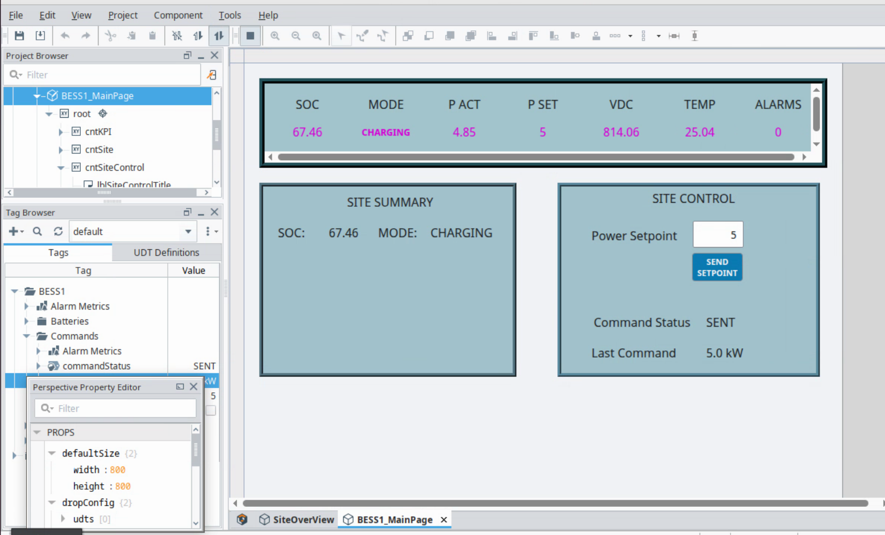
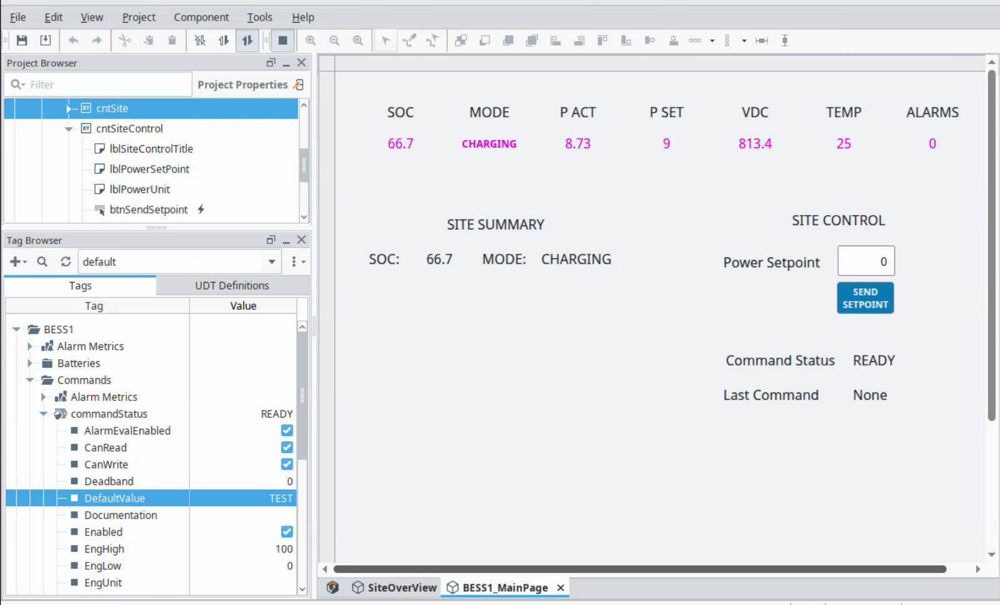
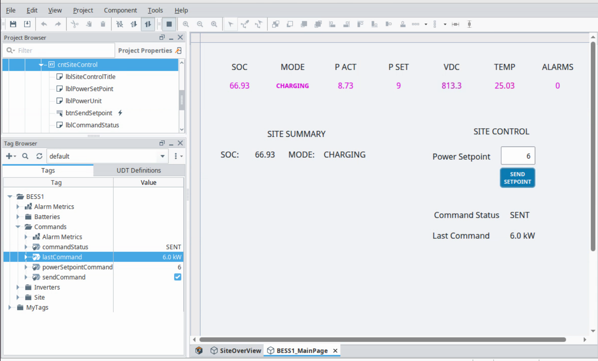
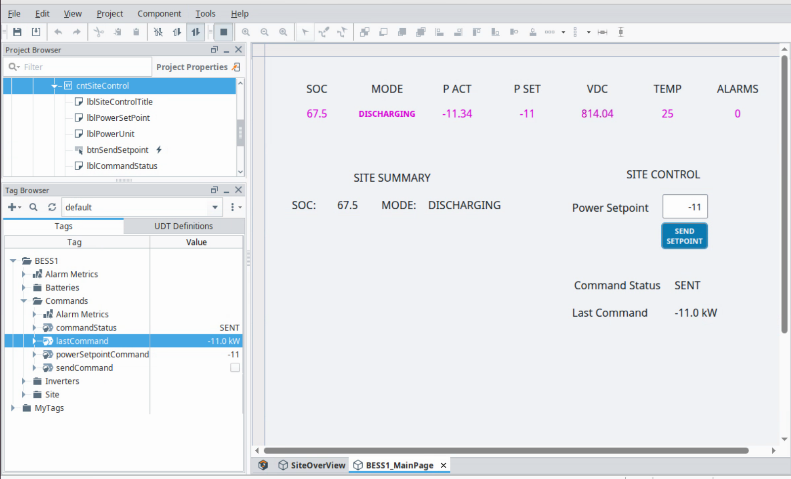
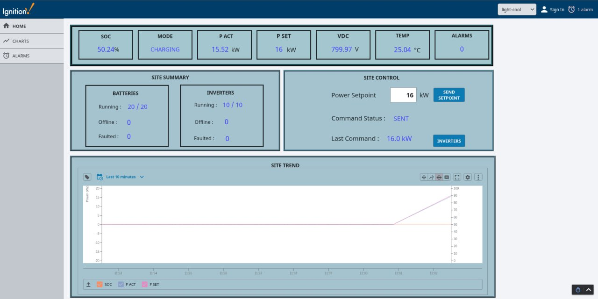
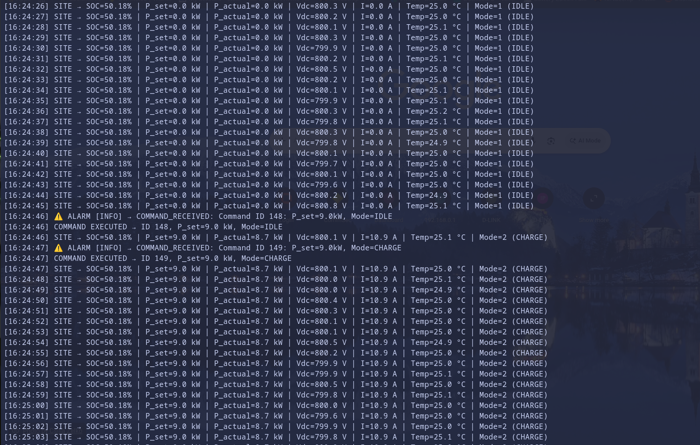

# BESS Digital Twin

A working Battery Energy Storage System (BESS) digital twin lab for learning industrial automation, SCADA integration, telemetry pipelines, and control-system architecture.

The project runs as a small distributed OT-style lab on Proxmox: a Python simulator produces BESS telemetry, PostgreSQL stores live state and commands, an OPC UA bridge exposes the data to Ignition, and an Ignition Perspective dashboard monitors and controls the simulated plant.

## Current Status

The core simulator -> database -> OPC UA -> Ignition loop is working.

- Python BESS simulator models site, inverter, and battery telemetry.
- PostgreSQL stores site status, equipment telemetry, alarms, and commands.
- OPC UA bridge publishes live values from PostgreSQL for SCADA consumption.
- Ignition Perspective displays live BESS values and sends charge/discharge commands.
- Runtime helper scripts start, stop, and check the simulator and OPC bridge.
- Local environment files keep credentials out of git.

See [docs/current_status.md](docs/current_status.md) for the latest working state and test evidence.

## Why This Project Exists

This repo is a practical automation lab, not just a toy simulator. It is designed to show how a BESS-style control system can be structured across realistic layers:

- plant simulation and state modelling
- telemetry persistence
- command handling
- OPC UA industrial communication
- SCADA dashboard integration
- alarm and runtime operations planning
- Proxmox-hosted lab infrastructure

The goal is to build a portfolio-quality engineering project that demonstrates software, controls, databases, and SCADA working together.

## Architecture

```text
Proxmox Host (Dell Precision T7810)
|
+-- VM1: BESS Engine (Ubuntu 22.04.5)
|   |
|   +-- bess.py
|   |   +-- Simulates site, inverter, and battery telemetry
|   |   +-- Writes telemetry to PostgreSQL
|   |   +-- Polls latest commands from PostgreSQL
|   |   +-- Simulator -> PostgreSQL (TCP/5432)
|   |
|   +-- opc_bridge.py
|       +-- Reads telemetry from PostgreSQL
|       +-- Exposes OPC UA tags for SCADA
|       +-- Writes SCADA commands to PostgreSQL
|
+-- VM2: Database Server (Ubuntu 22.04.5)
|   |
|   +-- PostgreSQL
|   +-- TimescaleDB telemetry storage
|   |
|   +-- Key tables
|       +-- bess_telemetry
|       +-- bess_status
|       +-- site_status
|       +-- inverter_status
|       +-- battery_status
|       +-- bess_alarms
|       +-- bess_commands
|       +-- ems_decisions
|       +-- system_events
|
+-- VM3: Ignition SCADA
    |
    +-- Perspective dashboard
    +-- OPC UA telemetry reads from opc_bridge.py on VM1
    +-- Command writes to opc_bridge.py on VM1
    +-- Ignition -> OPC UA bridge (TCP/4840)
```

Runtime deployment:

- Simulation VM: Python simulator and OPC UA bridge
- Database VM: PostgreSQL telemetry, alarms, and commands
- Ignition VM: SCADA dashboards, tags, and operator controls
- Proxmox host: isolated lab infrastructure

## Screenshots

### Ignition SCADA Dashboard



### Site Control Panel



### Command Response Evidence







### Simulator Runtime Log



## Features

- Site-level BESS simulation with SOC, voltage, current, power, temperature, and operating mode
- Multi-equipment model covering inverters and battery units
- Charge, discharge, and idle command handling
- PostgreSQL-backed telemetry and command path
- OPC UA bridge for industrial-style data exchange
- Ignition Perspective integration for live dashboarding and control
- Alarm table support for SCADA alarm development
- Local run scripts for repeatable simulator and bridge operation
- Documentation for runtime operation, status, and SCADA progress

## Repository Layout

```text
config/                 Host-specific configuration templates and local env files
data/                   Sample telemetry and development data
deployment/             Deployment notes and infrastructure material
docs/                   Status, runbook, evidence, and progress notes
src/database/           PostgreSQL client and schema
src/opcua_bridge/       OPC UA server and bridge logic
src/simulator/          BESS simulator models and runtime entrypoint
tests/                  Simulator tests
```

## Run Locally on the Lab VM

The live lab runs from:

```bash
cd /home/fox/bess-digital-twin
```

Check runtime status:

```bash
./status_bess_stack.sh
```

Start simulator and OPC bridge:

```bash
./start_bess_stack.sh
```

Stop both processes:

```bash
./stop_bess_stack.sh
```

See [docs/bess_runtime_runbook.md](docs/bess_runtime_runbook.md) for the full operational runbook.

## Validation

Current validation includes:

- simulator unit tests with `pytest`
- live command test from Ignition to simulator
- observed telemetry updates in PostgreSQL and Ignition
- OPC UA bridge runtime checks

Example confirmed command response:

```text
COMMAND RECEIVED: P_set=9.0kW, Mode=CHARGE
COMMAND EXECUTED: P_set=9.0 kW, Mode=CHARGE
SITE -> SOC=50.18% | P_set=9.0 kW | P_actual=8.7 kW | I=10.9 A | Mode=2 (CHARGE)
```

## Documentation

- [Current project status](docs/current_status.md)
- [Runtime runbook](docs/bess_runtime_runbook.md)
- [Portfolio case study](docs/portfolio_case_study.md)
- [Ignition charge command test](docs/evidence/ignition_charge_command_test.md)
- [Ignition dashboard progress](docs/progress/2026-05-15_ignition_dashboard.md)
- [Inverter overview progress](docs/progress/2026-05-16_ignition_inverter_overview.md)

## Roadmap

- Add more realistic alarm scenarios and latching behaviour
- Add inverter and battery detail pages in Ignition
- Add trend charts for SOC, power, voltage, current, and temperature
- Convert runtime scripts into systemd services
- Add EMS dispatch and optimisation logic
- Containerise selected components where it improves repeatability

## Security Notes

Local credentials are kept in ignored `.local.env` files. Do not commit database passwords, OPC UA secrets, tokens, or host-specific credentials.
