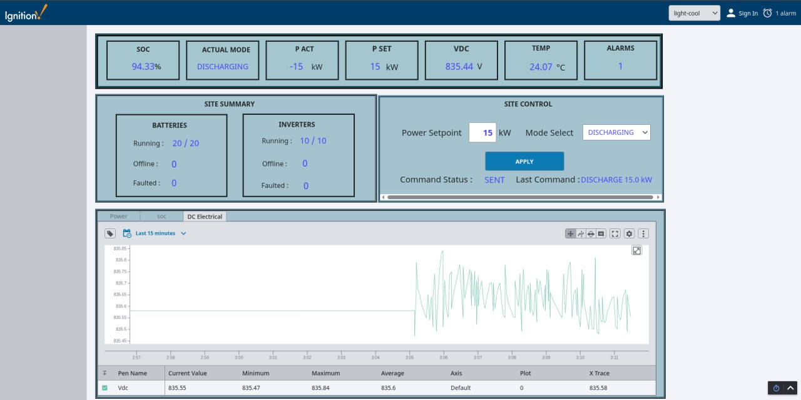
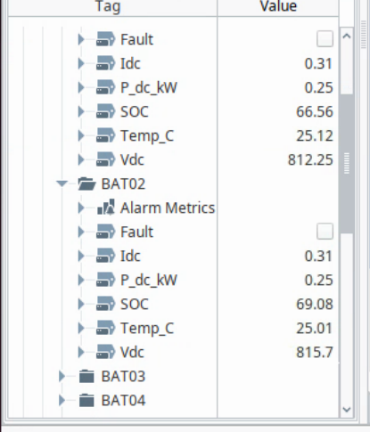
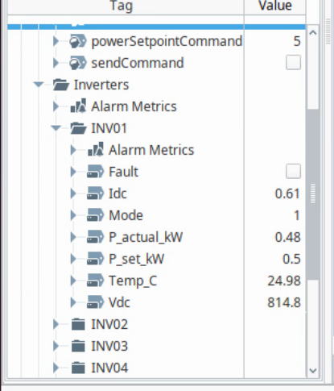

# Portfolio Case Study

## Project Summary

This project is a working BESS digital twin lab that connects simulation, telemetry storage, OPC UA communication, and Ignition SCADA into one control loop.

It demonstrates practical engineering skills across software, automation, databases, and infrastructure:

- Python simulation of BESS operating states and telemetry
- PostgreSQL-backed historian and command tables
- OPC UA bridge for SCADA integration
- Ignition Perspective dashboard for monitoring and command input
- Proxmox-hosted multi-VM lab architecture
- Runtime runbooks, validation notes, and operational scripts

## Engineering Problem

Battery Energy Storage Systems need reliable monitoring, command handling, alarms, and operational visibility. Real hardware is expensive and risky to experiment on, so this lab creates a controlled environment for testing BESS control concepts and SCADA workflows.

The design intentionally separates the simulator, database, and SCADA layers to mirror a real industrial system more closely than a single-process demo.

## Implemented System

```text
Proxmox Host (Dell Precision T7810)
|
+-- VM1: BESS Engine (Ubuntu 22.04.5)
|   |
|   +-- bess.py
|   |   +-- Simulates site, inverter, and battery telemetry
|   |   +-- Writes telemetry to PostgreSQL
|   |   +-- Polls latest commands from PostgreSQL
|   |   +-- Simulator -> PostgreSQL (TCP/5432)
|   |
|   +-- opc_bridge.py
|       +-- Reads telemetry from PostgreSQL
|       +-- Exposes OPC UA tags for SCADA
|       +-- Writes SCADA commands to PostgreSQL
|
+-- VM2: Database Server (Ubuntu 22.04.5)
|   |
|   +-- PostgreSQL
|   +-- TimescaleDB telemetry storage
|   |
|   +-- Key tables
|       +-- bess_telemetry
|       +-- bess_status
|       +-- site_status
|       +-- inverter_status
|       +-- battery_status
|       +-- bess_alarms
|       +-- bess_commands
|       +-- ems_decisions
|       +-- system_events
|
+-- VM3: Ignition SCADA
    |
    +-- Perspective dashboard
    +-- OPC UA telemetry reads from opc_bridge.py on VM1
    +-- Command writes to opc_bridge.py on VM1
    +-- Ignition -> OPC UA bridge (TCP/4840)
```

## Current Capabilities

- Live BESS site telemetry: SOC, voltage, current, power, temperature, and mode
- Equipment modelling for site, inverter, and battery layers
- Ignition command path for charge/discharge mode and power setpoint
- PostgreSQL persistence for current status, commands, and alarms
- OPC UA bridge exposing live database values to SCADA
- Runtime scripts for starting, stopping, and checking the stack
- Documentation of current status, runtime operation, and SCADA progress

## Evidence of Working Behaviour

A confirmed Ignition charge-command test changed the simulator state through the full command path:

- Ignition sent a 9 kW charge command
- OPC UA bridge wrote the command to PostgreSQL
- Simulator consumed the command
- Site mode changed to CHARGE
- Actual power followed the setpoint
- Ignition dashboard displayed the updated live state

Dashboard evidence:


The screenshot captures:

- `SOC`: 50.24%
- `Mode`: CHARGING
- `P_set`: 16 kW
- `P_actual`: 15.52 kW
- `Command status`: SENT
- `Active alarms`: 0

Split trend evidence:



This capture shows the separated Power, SOC, and DC Electrical trend tabs during a 15 kW discharge command.

See [current_status.md](current_status.md) and [evidence/ignition_charge_command_test.md](evidence/ignition_charge_command_test.md).

Ignition tag provider validation:



*Ignition tag provider validation for battery telemetry.*



*Ignition tag provider validation for inverter telemetry.*

## Technical Decisions

### PostgreSQL as the integration point

The database acts as a clean boundary between simulator state, command input, and SCADA publishing. This makes the system easier to inspect, test, and extend than direct coupling between Ignition and the simulator process.

### OPC UA for SCADA communication

OPC UA keeps the SCADA interface close to industrial practice and gives Ignition a realistic tag-based integration path.

### Multi-VM Proxmox deployment

Separating simulation, database, and SCADA into different VMs makes the lab closer to real OT architecture and supports future work on network segmentation, monitoring, backups, and service hardening.

## Skills Demonstrated

- Python application structure
- Control-system simulation
- Database schema and data-flow design
- SCADA integration with Ignition
- OPC UA server/bridge development
- Linux VM operations
- Runtime documentation and testing discipline
- Incremental engineering delivery

## Next Work

- Add alarm severity, latching, acknowledgement, and clear-condition logic
- Add richer inverter and battery detail views
- Refine trend chart styling, axes, and operator labels
- Convert runtime scripts into managed systemd services
- Add EMS dispatch logic and optimisation experiments
